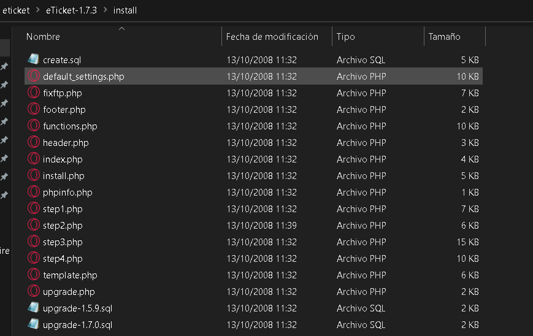

# Instalación eTicket
### Descarga PHP y MySQL
eTicket es un programa que necesita de PHP 5.x y MySQL 4.1 o mejor en un servicio web para poder instalarse y funciona correctamente, por ello empezaremos con la descarga de las correctas versiones de dichos programas.´

Para ello podemos ir a la página oficial de [Windows](https://www.youtube.com/redirect?event=video_description&redir_token=QUFFLUhqbWdqREdSTWdiaFJlUHdGOGhlcHh1d29XRk81d3xBQ3Jtc0trV0dIR0RUUEhPRnlOY09oRDRmNHV6WWtVdDhNV1VVNEVBSW85aFdUZEhBQ2FGQXZhMlZYWVVWc1pMcERYSW56R29XNDIxZjd3bFoycGdadEF6X21yRnpWVFp1S0RPSEFoSDZHNERueHFaVWlOWkE5OA&q=https%3A%2F%2Fwindows.php.net%2Fdownload%2F) o usar programas externos que lo hagan por nosotros, tales como [Web Plataform Instaler](https://www.youtube.com/redirect?event=video_description&redir_token=QUFFLUhqbDc0dHk3VEZYRTBBRV90d3hacUIxLUE5QU1Id3xBQ3Jtc0trMFRDVkpUMEY0STF5WkhsRnZUc0pwN213QVVmVFpmZVFsQlh2TkV4N0lXWGtKMnFTNmVlUE1kNl9zSFZVWjA5M3U3eWxhc0VuZ0ZQQWE3WWUyQ216SnY1R3hGMEFicC1LVnNyQ3YwR3lzUmxRVEFqNA&q=https%3A%2F%2Fwww.microsoft.com%2Fweb%2Fdownloads%2Fplatform.aspx), donde solo buscaremos el programa y nos mostrará todas sus versiones.

Aparte del PHP y MySQL también deberemos activar los "Internet Information Services (IIS)" en Windows 10, para ello nos dirigiremos al panel de control-programas y dentro seleccionamos la opción de "activar o desactivar las características de Windows". aquí ya prodemos activar las IIS.

### Instalar eTicket
Primero nos dirigiremos a su [página web](https://eticketsupport.com/about/) y descargaremos la última versión. 
Luego descomprimimos el ZIP en la carpeta de nuestro servidor web y crearemos una base de datos en MySQL con linea de comando (create database ...) o PHP. De vuelta en los archivos encontraremos dos archivos (“settings.php” y “pipe.php”) estos deben tener permisos de escritura, esto se consigue al entrar en una terminal y usar el siguiente comando:

*chmod 666 [nombrearchivo]*

Para finalizar la instalación nos dirigiremos a una carpeta con nombre install y seguimos las instrucciones que nos aparecen en pantalla.Y con eso la instalación esta lista para su uso.
[
